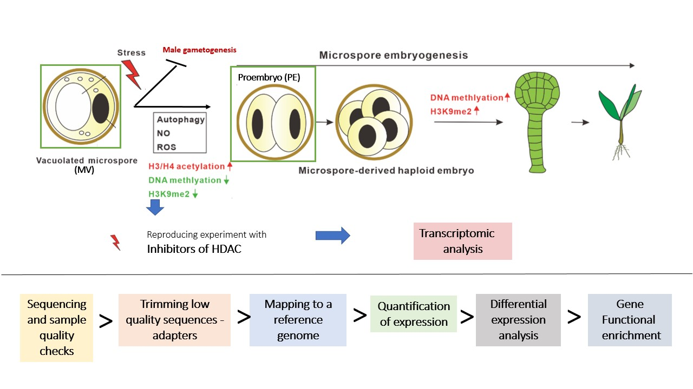

# Bnapus_ME Project


Transcriptomic analysis of epigenetic determinants of Microspore Embryogenesis in B.napus code for the Final Masters Thesis in Computational Biology

- [Objectives](#objectives)
- [Repositories](#repositories)
- [Reproducing the analysis](#get-started)

## [Objectives](#objectives)

The **main goal** is to analyze a high throughput mRNA transcriptome Paired End sequencing project with an unstranded library preparation of _Brassica napus_ microspore culture upon the first stage (1-5h) of Microspore embryogenesis (Vacuolated Microspore - MV to Proembryo (PE) conversion ) caused by treatment with Histone Deacetilase Inhibitors.



## [Repositories](#repositories)

### Code Project Repository (CPR)

Contains all code related to Quality Checks(QC), Trimming, Mapping, Sorting, Quantification of expression, Differential Expression Analysis (DE), Clustering Analysis -QC of DE and Gene Enrichment

### Supplementary Material Repository (SMR)

Contains some of the results given at different stages of the project.

## [Reproducing the analysis](#get-started)

You can use some of the functionalities provided for some of the steps in this pipeline to reproduce the analysis. To get the helper scripts, you can fork and then clone your own copy of the current repository using the following code, changing the `YOUR-USERNAME` string by your github account username
```
git clone https://github.com/YOUR-USERNAME/Bnapus_ME.git
```
To install dependencies required by the helper scripts, you should execute the following line with pip package manager, or manage your own conda environments using the dependencies described in `requirements_python.txt`

```
pip install requirements_python.txt
```
And to install R requirements
```
Rscript requirements_R.R
```
To view examples of how to implement different steps of the pipeline, you can find them in the `examples` folder.

### List of Authors

| Author name| Email|
|-----------------:|-----------|
| Natalia García Sánchez| natalia.garcia.sanchez@alumnos.upm.es|


## Code project information

| DA code project summary| |
|-----------------:|:-----------|
| Version: | v0.0.1 |
|Name:| Bnapus_ME TFM Project |
|Description:| Transcriptomic analysis of epigenetic determinants of Microspore Embryogenesis in B.napus|

